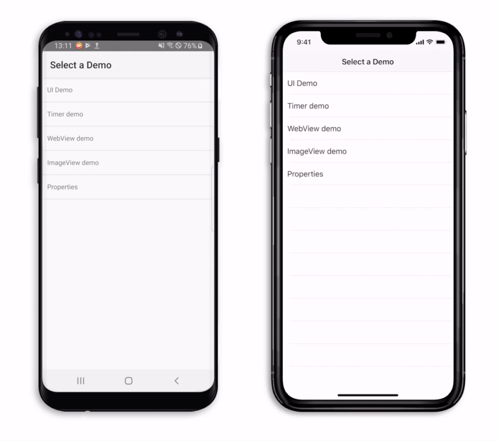

<h1 align="center">BODEN CROSS-PLATFORM FRAMEWORK</h1>

<h4 align="center">
	<p>Build purely native cross-platform experiences with Boden</p>
	<a href="https://www.boden.io">Website</a>
	<span> ⬡ </span>
	<a href="https://www.boden.io/getting-started">Getting Started</a>
	<span> ⬡ </span>
	<a href="https://www.boden.io/reference">API Reference</a>
	<span> ⬡ </span>
	<a href="https://www.boden.io/guides">Guides</a>
	<span> ⬡ </span>
	<a href="https://twitter.com/bodenhq">Twitter</a>
	<span> ⬡ </span>
	<a href="#contact--feedback">Feedback</a>
</h4>



* **Native widgets**: Instead of drawing widgets that look nearly identical to the platform's design, Boden uses native OEM widgets ensuring that your app will always have a truly native look and feel.
* **Fast**: Boden is written in modern C++17 to make development easy and apps fast and battery-friendly.
* **Open**: Boden is an open framework and welcomes contributions and feedback from the community. We want you to shape its development so Boden can meet your requirements.

> Note: This is a beta release. The Boden API is not yet fully complete and stable.

## Table of Contents

* [Getting Started](#getting-started)
* [Your First Boden Application](#your-first-boden-application)
* [Hello World](#hello-world)
* [Documentation](#documentation)
* [License](#license)
* [Contact & Feedback](#contact--feedback)

## Getting Started

### Prerequisites

**On a Mac**: macOS 10.14+, [Xcode 10.1+](https://developer.apple.com/xcode/), [Python 3.4+](https://www.python.org/downloads/), [CMake 3.10.2+](https://cmake.org/download/).

**On Windows**: Windows 10, [Python 3.4+](https://www.python.org/downloads/), [CMake 3.10.2+](https://cmake.org/download/), [Ninja](https://github.com/ninja-build/ninja/releases), [Git](https://git-scm.com/download/win), [Oracle JDK 8](https://www.oracle.com/technetwork/java/javase/downloads/jdk8-downloads-2133151.html), and [Android Studio](https://developer.android.com/studio) (with Android NDK, see the [installation instructions](https://www.boden.io/getting-started/installing_dependencies/windows/) for further details).

**On Ubuntu 18.04**: `sudo apt update && sudo apt install git cmake ninja-build python python3-distutils openjdk-8-jdk qemu-kvm` plus [Android Studio](https://developer.android.com/studio/) (with Android NDK, see the [installation instructions](https://www.boden.io/getting-started/installing_dependencies/linux/) for further details).

### Step 1: Clone the Boden Repo

	git clone --recurse-submodules https://github.com/AshampooSystems/boden.git

### Step 2: Generate and Open an IDE Project

	cd boden
	python boden.py open

This will bring up Xcode on macOS or Android Studio on Linux/Windows.

If anything goes wrong, please make sure that all dependencies are installed and set up correctly. Check out our extended guides for help:

* [Building Boden on macOS](https://www.boden.io/getting-started/building/mac/)
* [Building Boden on Windows](https://www.boden.io/getting-started/building/windows/)
* [Building Boden on Linux](https://www.boden.io/getting-started/building/linux/)

### Step 3: Run a Boden Example Application

In Xcode, select the `bodendemo` target and hit <kbd>Cmd</kbd>+<kbd>R</kbd>.

In Android Studio, select the `bodendemo` target and hit <kbd>Shift</kbd>+<kbd>F10</kbd>.

## Your First Boden Application

To create your first Boden app, open up a terminal (or command prompt), change to your local `boden` directory, and execute the following commands:

	python boden.py new -n AwesomeApp
	cd AwesomeApp
	python ../boden.py open

This will create a new folder named `AwesomeApp` and generate source and project files for a simple Hello World cross-platform application. The last command will prepare and open an Xcode project on the Mac or an Android Studio project on Linux/Windows.

In Xcode, select the `AwesomeApp` target and then press <kbd>Cmd</kbd>+<kbd>R</kbd> to build and run the Hello World application.

In Android Studio, wait for Gradle to finish its sync and configuration processes and then select the `bodendemo` target and press <kbd>Cmd</kbd>+<kbd>R</kbd> to build and run the example application, then select the `AwesomeApp` target and then press <kbd>Ctrl</kbd>+<kbd>R</kbd> on Mac or <kbd>Shift</kbd>+<kbd>F10</kbd> on Linux/Windows to build an run the Hello World application.

> Note: On macOS and Linux you can also simply type `./boden` instead of calling `python boden.py` explicitly. If you want to build the Android version of the app on macOS, run `../boden open -p android`.

## Hello World

Here's a quick look at the source code generated by the `boden new` command:

```C++
// MainViewController.cpp
#include <bdn/ui.h>
#include <bdn/ui/yoga.h>

#include "MainViewController.h"

MainViewController::MainViewController()
{
    _window = std::make_shared<bdn::ui::Window>();
    _window->title = "AwesomeApp";
    _window->geometry = bdn::Rect{0, 0, 400, 300};
    _window->setLayout(std::make_shared<bdn::ui::yoga::Layout>());

    auto button = std::make_shared<bdn::ui::Button>();
    button->label = "Hello World";

    _window->contentView = button;

    _window->visible = true;
}
```

`MainViewController.cpp` is the most interesting part of the source generated for the Hello World application. The main view controller will be instantiated at application launch. It's responsible for setting up the application's user interface.

Here's what the code does in detail:

First, create a new `Window` and set its title to `AwesomeApp`:

```C++
_window = std::make_shared<bdn::ui::Window>();
_window->title = "AwesomeApp";
```

To get an automatic layout, use a `yogalayout::Layout` and set a default window size:

```C++
_window->geometry = bdn::Rect{0, 0, 400, 300};
_window->setLayout(std::make_shared<bdn::ui::yoga::Layout>());
```

Then, instantiate a new `Button` and set its label to "Hello World":

```C++
auto button = std::make_shared<bdn::ui::Button>();
button->label = "Hello World";
```

As the button is the only control which will be displayed in this example, set it as the window's content view:

```C++
_window->contentView = button;
```

Finally, make the window visible:

```C++
_window->visible = true;
```

## Documentation

You can find the full [Boden documentation](https://www.boden.io/reference) on our [website](https://www.boden.io).

The Boden documentation is still work in progress. If you can't find the information you're looking for, please don't hesitate to ask by opening a [GitHub issue](https://github.com/AshampooSystems/boden/issues) or [contacting us directly](#contact--feedback).

## License

Boden is licensed under the GPL (2/3). Please refer to the [LICENSE file](LICENSE.md) for details.

We will most likely add LGPL as an option in the near future.

A commercial licensing option is available [upon request](mailto:boden-team@ashampoo-systems.com).

## Contact & Feedback

We are happy about your feedback!

Get in touch with us and stay up to date about Boden:

* Follow us on Twitter: [@bodenhq](https://twitter.com/bodenhq)
* Join the [Boden Google Group](https://groups.google.com/forum/#!forum/boden-cross-platform-framework)
* Email us: [boden-team@ashampoo-systems.com](mailto:boden-team@ashampoo-systems.com)

If you find something that is missing or doesn't work, please consider opening a [GitHub issue](https://github.com/AshampooSystems/boden/issues).